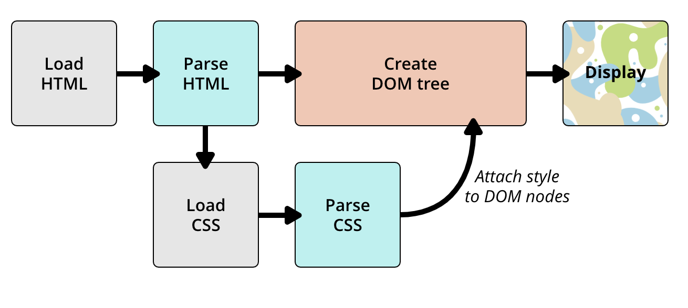
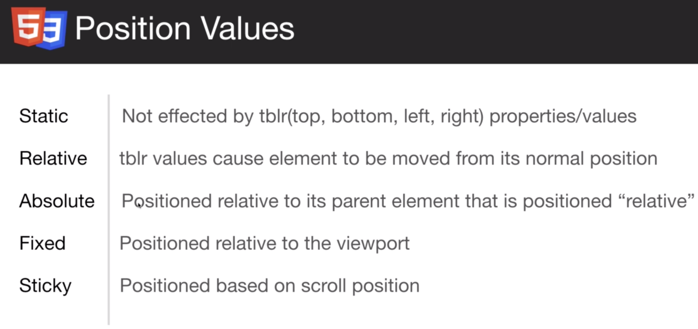

# Basics
-------
## What is CSS?
Like HTML, CSS is not really a programming language. It is not a markup language either — it is a style sheet language.

**How does CSS actually work ?**
  * The browser converts HTML and CSS into the DOM( Document object model). The DOM represents the document in the computer's memort. It combines the document's content with it's style.
  * The browser displays the contents of the DOM



Anatomy of a CSS Ruleset 
 

**Applying CSS**
You can apply CSS in 3 ways
* **External Stylesheet** : Link placed in the `<Head/>`
  Preferred way to do things, in production code.
  The href works the same way it works in `<a>` tags
  **`<link rel="stylesheet" href="./styles.css">`**
  
* **Internal Stylesheet** : Placed in the `<Head/>`
* **Inline Style** : Style mentioned inside the `element`
```javascript
<!DOCTYPE html>
<html>
  <head>
    <meta charset="utf-8">
    <title>My CSS experiment</title>
    // 1) External Stylesheet
    <link rel="stylesheet" href="style.css">
    // 2) Internal Stylesheet
    <style>
      h1 {
        color: blue;
      }
    </style>
  </head>
  <body>
    // 3) Inline Style
    <h1 style="color: blue">Hello World!</h1>
  </body>
</html>
```
  We don't want to put any inline / internal CSS in the actual HTML because we want to maintain **Seperation of concern**!! Keeping the markup and CSS seperate.
<hr>
## Selectors

1 ) Standard  Selectors

  * **Universal Selector** 
    ```javascript
    //Targets all elements
    * {
      color: red;
    }
    // Targets all child elements of Paragraph
    p > * {
      color: red;
    }
    ```
  * **Element Selector** 
    ```javascript
    //Targets all elements of input type
    input {
      color: red;
    }
    // Targets elements of Paragraph
    p {
      color: red;
    }
    ```
  * **Compound Selector**
    ```javascript
    // All of the input elements, textarea elements and select elements will be affected by these properties.
    input, textarea, select {
      display : block;
      padding: 7px;
    }
    ```
  * **Class Selector**
    ```javascript
    // Way to group elements that you want to style the same way.
    // All elements with class1 will be targetted.
    .class1 {
      background : aqua;
    }

    // All paragraph elements with class1 will be targetted.
    p.class1 {
      background : aqua;
    }
    ```
  * **ID Selector**
    ```javascript
    // Used to target a single unique element on a page.
    #ad1 {
      width: 768px;
    }
    // All Paragraph elements with id = ad1 will be targetted.
    p#ad1 {
      width:768px
    }
    ```

> **Using div#ad1 { } is a good way to visually let yourself know that you are targetting a div of id=ad1 , although id by itself would suffice.**
<br>
1) **Combinator Selectors**
   
    | Combinator     | Name          |
    | -------- | -------------- |
    | ```div p { }```  | Any Descendant combinator|
    | ```div > p { } ``` | Direct Child combinator  |
    | ```div + p { }``` | Adjacent Sibling combinator |
    |```div ~ p {}``` | General Sibling combinator|
    **Adjacent Sibling**
    
    **General Sibling**
    
    **Adjacent sibling selecor**
    


2) **Psuedo Selectors**
   
    Pseudo-classes allow the selection of elements based on state information that is not contained in the document tree.
    Example: a:visited will match all `<a>` elements that have been visited by the user.

    **You can tell you are dealing with psuedo selectors because they have colons in them**

    |Psuedo class Selector | Description|
    |---------------|---------|
    |`e:first-child { }`| Target first child of type e|
    |`e:last-child { }`|Target **last child** of type e|
    |`e:first-of-type { }`|Target **first of type e**|
    |`e:last-of-type { }`|Target **last of type e**|
    |`e:only-child { }`|Target all only-child(s) of type e within other elements|
    |`e:only-of-type{ }`|Target an element if its the only one of its type e within its parent|
    |`e:empty { }`| Targets an element if it is the only element of type e that is empty. `Ex : <li><li>`
    |`e:root { }` | The HTML element itself|

    |Nth  Selector | Description|
    |---------------|---------|
    |`e:nth-child(n)` | The nth child of type e |
    |`e:nth-child(even)` | All even children of type e |
    | `e:nth-child(odd`| | All odd children of type e |
    |`e:nth-last-child(n)` | The nth child from bottom of type e, 1 would target the bottom most.|
    | `e:nth-of-type(n)`|Targets nth child of type e |
    | `e:nth-last-of-type(n)`|Targets nth child of type e, from bottom. 1 would be the bottom most |

    |Other | Description |
    |--|--|
    |`e:enabled`| Targets all enabled selectors of type e|
    |`e:disabled`| Targets all disabled selectors of type e
    |`e:checked`| Targets all checked selectors of type e
    |`e:active`| Targets all elements of type e when user interacts with the element. Ex : A click on a `<p>`.
    |`e:hover`| Targets all elements of type e when user hovers over the element.
    |`e:focus`| Targets all elements of type e when the user focuses on it.|


3) **Pseudo element selectors**
   Pseudo-elements represent entities that are not included in HTML.

   Example: p::first-line will match the first line of all `<p>` elements.
    |Pseudo Element selectors| Description|
    |---|---|
    |`e::first-line`| Targets the first formatted line within the element e|
    |`e::first-letter`| Targets the first letter within the text node of the element e|
    |`e::before` { content: ..}| Lets you place some content before the content of the element itself.|
    |`e::after` { content: ..| Lets you generate content after the content of the element|

    >**Pseudo element selectors always have two colons `::` , and there's only 4 of them.**

## Inheritance and Cascade
  

  * CSS inheritance refers to the relationship between HTML tags (think parent and children tags) and how certain CSS styles can apply to a tag even though there aren’t any CSS rules directly applied to it.
  * Cascading refers to the fact that cumulative styles across multiple CSS rules are applied to each and every HTML tag.
    
## Specificity

Specificity is basically a measure of how specific a selector is - how many elements it could match.

If a CSS rule has lower specificity than another, then it loses out to the other rule, this is how the cascade principle ties in with specificity.


|Sample Calculations| Specificity|
|----|-----|
|`ul#nav li.active a`|0,1,1,3|
|`body.ie7 .col_3 h2 ~ h2`|0,0,2,3|
|`li style="color:red;"`|1,0,0,0|
|`ul > li ul li ol li:first-letter`|0,0,0,7|

**Notes**:
- Do not confuse inheritance with specificity , they are both seperate concepts that work together. Inheritance dicates what rule is applied what element, specificity is a tie-breaker ( based on weightage) when multiple rules are applied to the same element
- The universal selector (*) has no specificity value (0,0,0,0)
- Pseudo-elements (e.g. :first-line) get 0,0,0,1 unlike their psuedo-class brethren which get 0,0,1,0
  
  >The !important value appended a CSS property value is an automatic win. It overrides even inline styles from the markup. The only way an !important value can be overridden is with another !important rule declared later in the CSS and with equal or great specificity value otherwise. You could think of it as adding 1,0,0,0,0 to the specificity value.

**Specificity Best practices**
* Use LVHA for link styling. “To ensure that you see your various link styles, you’re best off putting your styles in the order “link-visited-hover-active”, or “LVHA” for short.”

* Never use !important. “If you’re having specificity issues, there’s some quick ways to solve it. First, avoid !important.” “The !important declaration overrides normal declarations, but is unstructured and rarely required in an author’s style sheet.” 
  
* Use id to make a rule more specific. Replacing a.highlight with ul#blogroll a.highlight changes the specificity from 0, 0, 1, 1 to 0, 1, 1, 2.

* Minimize the number of selectors. “Use the least number of selectors required to style an element.” 

CSS specificity calculator : https://specificity.keegan.st/

## The Box Model
> Boxes, boxes, it's all about boxes. Every element is a BOX.

Writing CSS is a lot about boxes - Setting their size, color and position.
Most of the HTML elements on the page can be thought of as boxes sitting on top of each other.

There are 5 important properties that allow you to size and distribute your HTML elements:

- **Width**    : Width of a house
- **Height**   : Height of the house
- **Padding**  : Lawn
- **Border**   : Fence
- **Margin**   : Tress, shrubs and unused land between fence and neighbour

Here is what that looks like in a diagram:
 

Notes:
* Background color affects only the pixels within the border. Margins are not affected.
* When you declare margin and padding with one value, like 4px, CSS automatically applies the number to the top, bottom, left and right of the element.
* Margin lies outside the box , padding lies inside!
* The default height of a box is determined by how much content it holds.
* The default width of a box is determined by if it is an inline / block level element.
  
We can visualize the box model from using a house analogy.
```javascript
.myProperty{
    width: 40px;
    height: 20px;
    padding: 8px 4px;
    border: 1px solid brown;
    margin: 4px 8px;
}
```
 

 The difference between the margin and the padding is perhaps the most challenging part. The two are used for different reasons. As you can see with the green grass, the padding will still have a background color, if you choose to set it. This is also the property you want to change if you want to change the distance between the border and the content.

  **Border-box**
  The box-sizing property defines how the width and height of an element are calculated: should they include padding and borders, or not.

  Include padding and border in the element's total width and height:

  `box-sizing : border-box` property.

  Without this padding will not be counted as part of the width of the element!
<hr>
## Positioning
When we need to shift things left and right, we used `margin left` and `margin right`.
 To center an element we use `margin: 0 auto`

 We can't really rely on that because margins and paddings affect other elements around the element you apply it on.

 Applying positions however impact the exact element we are dealing with.

 There 5 positions values in CSS

 1. **Static** : Default value in CSS.
    After applying a position in CSS, we can use top and left to that element to move it around.
 2. **Fixed** : When you apply fixed to an element, you         take it out of the flow of the document and you can        control it using ```top``` and ```left```
    It can overlap and doesn't really care about other elements. It does not move regardless of what happens, including scrolling or othre elements.

    Usually used for Nav bars.
3. **Inherit** : It's just going to inherit the position from the parent.
4. **Absolute** :
  It's going to take it out of the flow of the document fix it to the position similar to `fixed` but one difference is that it is not fixed to the location, if you scroll it moves along with all other elements.
  When you give an element Absolute positioning, it positions an element relative to the nearest element that is not staticly positioned.
  Going by this logic, an absolute element has a parent, which is by default the browser, if there is a closer parent( an element with some positioning other than static) then it choses that as the parent.
      ```
      .box2 {
        background : lightpink;
        position: absolute;
        top:0;
        left:0;
      }
      ```
3. **Relative** :Positions it relative to the default position of the element in the document.
For example in this case, we would be position the element box 50px below the current position and 50px right .

      ```
      .box3 {
        background : lightpink;
        position: absolute;
        top:50;
        left:50;
      }
      ```
    
    
      

**Difference between absolute and relative** :
          1 - The starting point
              *  Absolute starts at top left of browser / parent
              *  Relative starts at where it would have been at in the flow of the document.
          2 - When it comes to using Relative - Space is not taken up by other elements.

  Z-Index : The `z-index` is used to specify the order of stacking when it comes to overlapping elements. A higher Z-index means that element is on top of the lower Z-indexes. Also these Z-indexes can only be applied if the element is `relative, absolute or fixed`.

  [Example Fiddle : #1](https://jsfiddle.net/619xqzj3/823/)
  [Example Fiddle : #2](http://jsfiddle.net/jcolicchio/Q6yN7/)

### Float & Clears 

Options for `float` are `float: none` `float: left` `float: right`.

Float is used to take an element ( usually an image ) and make it float,  and all other elements in the flow of the document go underneath it. kinda like how a cloud would float in the sky and everything is under it.

>However text does not go under neath it. It wraps around it.

####Initial intention of **Float**
A common technique to position content, either very left or very right.
It takes the element out of the flow of the content.

If you float an image and have some text around it 

```
img {
  float: left;
  margin: 10px;
}
```
The text wraps around it and you get a better looking document page.

#### Other uses : 

If we float an element to lets say the right, then other elements might take it's place because the element is taken out of flow.

#### Clears

`clear:both` is used to to specify the fact we don't want an element to be under floating items. When used it forces an element to stay clear of floating items, meaning it does not go under it and starts after the element.

So it is used on items neigboring floating items, forcing a new line.


## Display

1. **Inline** 
    - Do not Start on a new line.
    - Take only the necessary width
    - Ex : `<span>,  , <a>`
2. **Block**
    - Start on a new line
    - Take full width whenever available.
    - Ex : `<div>, <h1> - <h6>, <p>, <form>`

<hr>
## Fonts

We might want to use different fonts for different websites from different sources.

**Web safe fonts** : There are some font families , which are available in all browsers and these are called web safe fonts. Any other fonts must be included withint the web document bundle like you would include a CSS file.

Font-based properties.
```
body{
  font-family: Verdana, Geneva, Tahoma, san-serif
  font-size: 18px;
  font-weight: bold;
  font-style: italic;
  line-height: 1.6em;
}
```

**Using an external Font** : Google fonts
* Go to fonts.google.com 
* Search for a font and copy it's link / import it
* Add the font family to your html and you're done.
<hr>
## CSS Units
**Absolute**
cm : Centimeters
mm : millimeters
**Relative**
%   : To parent element
em  : To font-size of parent element
rem : To font-size of root element
vw  : To 1% of viewport width
vh  : To 1% of viewport width
<hr>
## Colors

Colors are set using the `color : ...` property.
We can use it for borders, background or a color property or anything in general.

There are usually 3 options of setting color .
* **Using the color name** 
  ```
  h1 {
    color: red;
  }
  ```
* **Using the RBG triplet**
  ```
  h1 {
    color: rgb(255,0,0); //red
  }
  ```
* **Using the Hexadecimal format**
  ```
  h1 {
    color: #ff0000; //red
  }
  ```
  Just like RGB, the first two are for R ,the second is for Green and the last two for Blue.

  The only one we want to remember the numbers for the basic ones.

  Reference website : www.color-hex.com
<hr>
## Backgrounds and borders

####Borders
Border has 3 **mandatory** properties.
```
border-width: 3px;
border-color: red;
border-style: solid;
```

The prefered way to do it is using all three properties in one line! 
`border: 3px solid red`

We could also opt to use `border-top` or `border-left` etc, just to target those specific ones if prefered.

**Border radius**
We can round off the default square radius by using a `border-radius: 10px` property

>**border-radius is a CSS3 property : before this we had to insert images for the border corners to look rounded**

####Backgrounds

* Backgrounds can be set using either the `background` or `background-color` property.

* You can also set images as backgrounds using the following syntax.
  ```
  #box {
    background-image: url(`./image.png`);
  }
  ```

  Rarely you might also need to use the `background-repeat` property to render multiple copies of the background image to cover the whole element / div incase the image is too small .

  You could also use the `background-position` keyword to move the background image around!

* Having a fixed image as a background is handy at times as well.
  ```
  background: url('./img/leaf.png') no-repeat center center;
  background-attachment: fixed;
  ```
  The first property is combination of all the other properties in one line!
<hr>
## Box Model
<hr>
## Float and Align

* **Centering** :  We grab the content we want to center, and put it into a container div, then we give it a width and set margin to auto.
  ```
    .container {
      width: 980px;
      margin: 0 auto;
    }
  ```
  The issue with this way of centering using the `width` property is that it is not responsive and fails on smaller devices. We can better this by using `max-width`
    ```
    .container {
      max-width: 980px;
      margin: 0 auto;
    }
  ```
  When you have specified a width on the object that you have applied margin: 0 auto to, the object will sit centrally within it's parent container.<br>
  Specifying auto as the second parameter basically tells the browser to automatically determine the left and right margins itself, which it does by setting them equally. It guarantees that the left and right margins will be set to the same size. The first parameter 0 indicates that the top and bottom margins will both be set to 0.

* **Text-align** : Used to align text inside an element, does not align anything else.
  Default value is left! 
  Possible values : `left`, `right` , `justify` and `center`
* **Floats**
  Before flexbox and grid this was used to align elements and boxes on a web-page . It is recommended now since it is hard to make it responsive and also needs to be cleared, but it is still good to know how these work.<br>
  How to use floats :
  * Float in a direction . `float:left`
  * Set a width. `width:70%`
  * Set border-box value. `box-sizing: border-box`
*
<hr>
## Inline vs Block
  We change `block` level items to `inline` and vice versa!

  For example by default `li` items are `block` by default.

  **Reason to change inline to block** : to add `margin:auto`. We can't do `margin:auto` on an inline element.
  **Reason to change block to inline** : Stack `li` elements on one line , like a nav bar.

  **Inline-block** : A mix of both ! 

  This lets you set width, as well as stays in the same line, since you can't set width on `inline` elements
<hr>
## CSS Reset 
```
* {
  margin: 0;
  padding: 0;
  border-sizing: border-box;
}
```
Removes all the default spacing that the browser gives across all elements!

