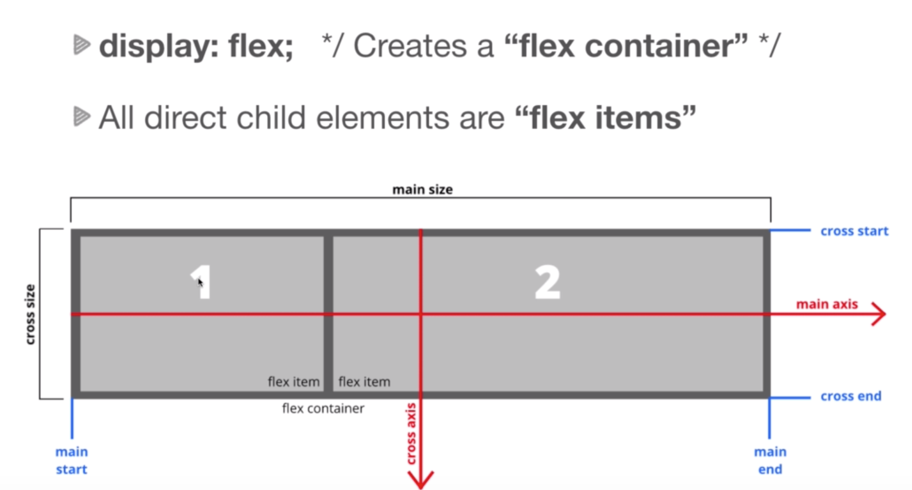

#Flebox
-----
## What is flexbox ?
* Flexbox is a modern layout mode in CSS3
* `flex` is a vlaue for the **display** property
* Replaces floats and is much more elegant to work with.
* Aligns items both horizontal(row) and vertical(column)
* Flex items can be re-ordered via CSS

## How it works ?

