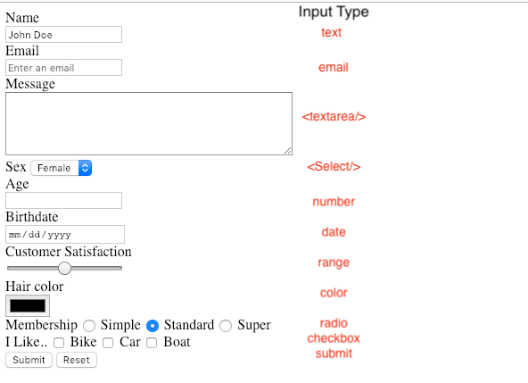
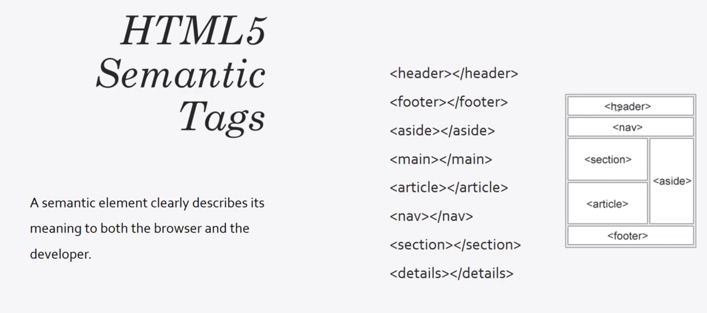

# HTML
----
* HTML stands for **Hyper text markup language**
* **NOT** a programming lanugage.
* It is a markup langauge for creating webpages and documents.
* Building blocks of the web.
* `index.html` is the root/home page of a website.

## DOCTYPE 
* First thing on the page, even before the `<html>` tag
* `<!DOCTYPE html>` is the declaration of what kinda HTML is written to the browser. The one given here is the one for HTML 5.
  Other Doc types are more complicated.

## Tags
* Element names surrounded by angle brackets. 
  
  `<Head> ... </Head>`
* Normally come in pairs ( start tag and end tag)
* End tag is usually the same but with a forward slash
* Some tags close themselves ( Remnant of XHTML , don't need to do this in HTML5)
  
  `<br />` (Self closing)

  `<br>` Fine in HTML5

**Tag attributes**
* All tags can have attributes.
* Provide information about an element
* Placed withing the start tag
* They are Key/value pairs( id = "someid")

```
  <tagname attributename ="attributevalue"> content </tagname>
  <h1 title="my company"> About us </h1>
```
## Html element Text setting 

.textContent 
.innerText
.innerHTML 

## Head 
* Contains information about the page, but no visual data.
* Usually contains meta tags, titile , etc
* You should atleast have a  `<title>` tag inside the `<Head>` tag. 
## Body 
  Actual Markup that's going to display in the browser.

## Meta Tags & Search Engines
* `<charset> UTF-8` : character set that this page uses
* `<meta name="viewport content="width=device-width, initial-scale=1.0`>
  This needs to be set to make the page responsive. 
* **Search engines** use the `<title>` tag to optimize their search, so you want to put sensible and leverage yout title to stand out in searches! This shows up on your search results page as the title of each result too!
* What you put in `<meta name="description" ...>` tag shows up on the search results page as body.
* The keywords tag used to hold a lot of importance, but now it is not super important, but generally it is recommended to have 8-12 keywords.`<meta name="keywords" content="web development, web design">` 
* The robots meta tag disables showing your page in any of the search engines.
  `<meta name="robots" content="NOINDEX, NOFOLLOW">`
<hr>
## Headings 

* We have 6 headings from `h1-h6` and the browser has some default styling to handle these tags, and also add some padding according to the levels, h1 has more than h6 for example.
* Headings are **Block level** tag.
* You want to have only one `<h1>` tag per page, for **SEO purposes**

## Paragraphs

* Paragraphs have some default styling too, just like Headings. 
  For example : they are `display:block`. It also has some default margins and paddings.

    `<Strong> </Strong>` : By default it implies the text here will be bold, you can change it to whatever you want it to represent
    `<em> </em>` : By default it is italics. It stands for emphasized!


## Typography
  * The `<br>` tag is used for a lone break
  *  The `<hr` tag is used for a horizontal line break too, but it adds an actual line.
<hr>

## Links
  - Links are representing by the `<a>` tag
  - The `href` attribute specifies where to point to. It can be local/ global.
  - The `target=blank` attribute means open link in new tab.
    `<a href="http://google.com" target="_blank">` 
  - You want to open **external links in new tabs** and **internal links in the same tab**. Just some convention you want to keep in mind.
 ## Images
   * Self closing tag , Inline tag
   * the `src` attribute holds the link to the image itself.
   * the `alt` attribute holds some alternate text to display incase the image is not found.
   * There is also a Height and width attribute that you can leverage, although CSS is a better way to do it.
  <hr>
## Lists
 - **Unordered list** `ul`
    - Bullet points
    - Used for website navigation. 
    - Display - Inline
    - Used for Nav bars ( more commonly used that `<ol>`)
 - **Ordered List** `ol` 
    - Has Numbers for the list Items by default
    - It can be changed using the `'type=A'` attribute.

    >Both lists contain a `li` - List item.
<hr>
## Tables
 * Contains two parts - head and body.
 * Head 
    * It contains Table row `<tr>` and table heading `<th>`
 * Body
    * It contains Table row `<tr>` and table data `<td>`
   
   >Both Head and body contain <tr> : table row.
 
 Tables are meant to be used for tabular data only, but do not use it for a layout( used to be how it was done in 1990's - 2000)
<hr>

 ## Forms

 * With HTML we can create the look of a form but we can't create the functionality of a form. We need JS for that!
 * `action` attribute is going to submit the form to another page
 * `method` attribute specifies what kind of HTTP request is being done, for example `method = post`
 * An `input` attribute is needed for users to submit some form of data into the form.
    `<input type="text" name="lastname">`
 * `Labels` and `inputs` are commonly used in forms, but they are in-line elements, so to bring them to different lines, we want to wrap them in `divs` since divs are block level elements.
 * **Input types**
   * Input type=text is the most common one, but we also have `type=Email`, with HTML5 we have some extra validation which lets the user not specify incorrect entries to an extent!
   * `Textarea` is used to enterlong messages with a custom size component.
   * the `<select>` tag is used to create a dropdown kinda option selector , with the `option` selector.
   * Other notable `input` types are **number** and **date** . These are HTML5 standards.
   * HTML5 added a `placeholder` attribute for you to use, before we needed JS to do this.
   * `<input type="submit" value=Submit>` would be the last field in the form which provides a button for the user to click submit and submit it to process.php
    <br>
    
 <hr>

 ## Divs , IDs , Classes , Spans 
  
  * **Classes vs Ids** : Classes can be repeated, whereas ID is unique and it is best practice to not repeat them!

  * **Divs vs Spans** : Div is a block level element. It pushes the next thing to the next line! Where as a Span is an in-line element!
 <hr>

 ## Block vs In-line
  * A block level element will take 100% of the width and span all across the page. The next div will go to the next line .
  
  * Where as an inline element will not take 100% of the width and the next thing you put in the body will not go to the next line.

  

 <hr> 

 ## Entities and Symbols
  * **Non breaking space** : `&nbsp`, used for putting in white space in html, since regular space won't be recognized by HTML.
  * **Greater than** : `&gt`
  * **Lesser than** : `&lt`
  * **Currency** : `&euro`
  *  **Card Suites** : `&clubs`
  *   **Copyright** : `&copy`
 <hr>

## HTML5 Semantic tags
   

   Search engines like google will actually look at the tags and use that for showing results!

## Template Tag

  The template tag hides the content from the client, the contents from it can be rendered using JS.

  Use the `<template>` tag when you have HTML code you want to use over and over again, but not until you ask for it. To do this without the `<template>` tag, you have to create the HTML code with JavaScript to prevent the browser from rendering the code.
  
  ```html
  <!DOCTYPE html>
  <html>
  <body>

  <h1>The template Tag</h1>

  <p>Click the button to get the content from a template, and display it in the web page.</p>

  <button onclick="showContent()">Show content</button>

  <template>
    <h2>Flower</h2>
    
  </template>

  <script>
  function showContent() {
    var temp = document.getElementsByTagName("template")[0];
    var clon = temp.content.cloneNode(true);
    document.body.appendChild(clon);
  }
  </script>

  </body>
  </html>
  ```

## Progress Tag

The HTML `<progress>` element displays an indicator showing the completion progress of a task, typically displayed as a progress bar.

`<progress value="70" max="100">70 %</progress>`

## Quotations
   You can use the `blockquote` tag to mention some text along with a link to the citation!

## `abbr` tag
   Used for abbreviations, which shows the full title on Hover!