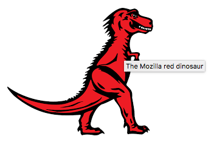

# Accessibility
<hr>
## Why accessibility ?

Accessibility is the practice of making your websites usable by as many people as possible — we traditionally think of this as being about people with disabilities, but really it also benefits other groups such as those using mobile devices, or those with slow network connections.

You could also think of accessibility as treating everyone the same, and giving them the same opportunities, no matter what their ability or circumstances. In the same way that it is not right to exclude someone from a physical building because they are in a wheelchair (public buildings generally have wheelchair ramps or elevators these days), it is also not right to exclude someone from a website because they have a visual impairment. We are all different, but we are all human, and therefore have the same (human) rights.

**Benefits**
* Semantic HTML (which improves accessibility) also improves SEO, making your site more findable/marketable.
* Caring about accessibility demonstrates good ethics/morals, which improves your public image.
* Other good practices that improve accessibility also make your site more usable by other groups, such as mobile phone users, those on a low network speed, etc. In fact, everyone can benefit from many such improvements
* It helps disabled people.
* It is the law in certain places.

**What kinds of Disablities are we looking at?**
 * Visual impairments ( color blind, blind , low level vision). Solved with screen readers, contrast colors.
 * Hearing impairments ( low hearing to none ). solved with captions, transcripts.
 * Mobility impairments ( paralysis , loss of limb , weakness, old age). Affects mouse usage. Solved by keyboard tabbing
 * Cognitive impairments ( mental illnesses and cognitive impairment). Solved with good design and consistency. simplicity.

**Project based decisions to keep in mind**
* Consider accessibility from the start of a project, and test early and often. Just like any other bug, an accessibility problem becomes more expensive to fix the later it is discovered.
* Bear in mind that a lot of accessibility best practices benefit everyone, not just users with disabilities. For example, lean semantic markup is not only good for screen readers, it is also fast to load and performant, so better for everyone, especially those on mobile devices, and/or slow conections.
* Publish an accessibility statement on your site and engage with people having problems.
<hr>
## Accessibility Tree

This is basically what the browser actually presents to the screen reader. The browser takes the DOM tree and modifies it into a form that is useful to assistive technology. We refer to this modified tree as the Accessibility Tree.

You might visualize the accessibility tree as looking a bit like an old web page from the '90s: a few images, lots of links, perhaps a field and a button.


**Flow for Accessibility tree creation**
  1. The browset exposes a semantic version of its UI to screen reader via an API.
  2. A screen reader creates an interface in which the user hears a spoken representation of the app.
  3. The assistive technology may also allow the user to interact with the app in a different way. For example, most screen readers provide hooks to allow a user to easily simulate a mouse click or finger tap.
  4. The assistive technology relays the user intent (such as "click") back to the app via the accessibility API. The app then has the responsibility to interpret the action appropriately in the context of the original UI.
<hr>
## HTML and accessibility

###1. Semantic HTML
>This means using the correct HTML elements for their correct purpose as much as possible.

The reason Semantic HTML is a game-changer is because 
* In built keyboard accessibility. They can be tabbled and activated using enter.
* Easier to read and develop.
* Better on mobile.
* Good for SEO.

**Non semantic Example**
```javascript
<font size="7">My heading</font>
<br><br>
This is the first section of my document.
<br><br>
I'll add another paragraph here too.
<br><br>
1. Here is
<br><br>
2. a list for
<br><br>
3. you to read
<br><br>
<font size="5">My subheading</font>
```
Here the screenreader hasn't got anything to use as signposts, so you can't retrieve a useful table of contents, and the whole page is seen as a single giant block, so it is just read out in one go, all at once.

**Semantic Example**
```javascript
<h1>My heading</h1>

<p>This is the first section of my document.</p>

<p>I'll add another paragraph here too.</p>

<ol>
  <li>Here is</li>
  <li>a list for</li>
  <li>you to read</li>
</ol>

<h2>My subheading</h2>
```
The screenreader reads each header out as you progress through the content, notifying you what is a heading, what is a paragraph, etc.
It stops after each element, letting you go at whatever pace is comfortable for you.
You can jump to next/previous heading in many screenreaders.
You can also bring up a list of all headings in many screenreaders, allowing you to use them like a handy table of contents to find specific content.

**Layout creation**

Use semantic tags like `<main>` `<footer>` `<article>` `<section>` `<header>` `<nav>` for creating layouts, instead of relying on things like table layouts.

**UI controls**
Use links, buttons, form elements, and labels appropriately (including the `<label>` element for form controls).

However, it is again the case that people sometimes do strange things with HTML. For example, you sometimes see buttons marked up using `<div>`s, for example.

You immediately lose the native keyboard accessibility you would have had if you'd just used `<button>` elements, plus you don't get any of the default CSS styling that buttons get.

###2.Keyboard accessibility

We can add back keyboard accessibility to even elements which don't have keyboard tabbing built it by default ( like `divs` for buttons), by using the `tabindex` attribute.

```javascript
<div data-message="This is from the first button" tabindex="0">Click me!</div>
<div data-message="This is from the second button" tabindex="0">Click me too!</div>
<div data-message="This is from the third button" tabindex="0">And me!</div>
````

>**Tab Index is an attribute primarily intended to allow tabbable elements to have a custom tab order, instead of just being tabbled through in their default source order, so this must be used only if you need to(for elements which are no in the tab order itself)**

* `tabindex="0"` - allows elements that are not normally tabbable to become tabbable. this is the most useful trick for elements like `divs`
* `tabindex="-1"` - this allows not normally tabbable elements to receive focus programmatically, e.g. via JavaScript, or as the target of links.

Whilst the above addition allows us to tab to the buttons, it does not allow us to activate them via the Enter/Return key. To do that, we had to add the following bit of JavaScript trickery:

```javascript
document.onkeydown = function(e) {
  if(e.keyCode === 13) { // The Enter/Return key
    document.activeElement.click();
  }
};
```
Here we add a listener to the document object to detect when a button has been pressed on the keyboard. We check what button was pressed via the event object's keyCode property; if it is the keycode that matches Return/Enter, we run the function stored in the button's onclick handler using `document.activeElement.click()`. activeElement gives us the element that is currently focused on the page.

This is a lot of extra hassle to build the functionality back in. And there's bound to be other problems with it. **Better to just use the right element for the right job in the first place.**

### 3. Meaningful text labels
You should make sure that your button and link text labels are understandable and distinctive. Don't just use "Click here" for your labels, as screenreader users sometimes get up a list of buttons and form controls.

Controls being listed in VoiceOver on mac


**Labels in links**
```javascript
// Good link text
<p>Whales are really awesome creatures. <a href="whales.html">Find out more about whales</a>.</p>

// Bad link text
<p>Whales are really awesome creatures. To find more out about whales, <a href="whales.html">click here</a>.</p>
```
**Labels in forms**

```javascript
// Good form label
<div>
  <label for="name">Fill in your name:</label>
  <input type="text" id="name" name="name">
</div>

// Bad form label
Fill in your name: <input type="text" id="name" name="name">
```
>As an added bonus, in most browsers associating a label with a form input means that you can click the label to select/activate the form element. This gives the input a bigger hit area, making it easier to select.

### 4. Tables

### 5. Multimedia alternatives
Whereas textual content is inherently accessible, the same cannot necessarily be said for multimedia content — image/video content cannot be seen by visually-impaired people, and audio content cannot be heard by hearing-impaired people.

```javascript
// No context for screen readers


// ALt text available


// Alt text + title available. Title will give more context , also when you hover over the image , it would show the text


<p id="dino-label">The Mozilla red Tyrannosaurus Rex: A two legged dinosaur standing upright like a human, with small arms, and a large head with lots of sharp teeth.</p>
```


**Empty alt attributes**
```javascript
<h3>
  
  Tyrannosaurus Rex: the king of the dinosaurs
</h3>
```
This can be done for images, which are needed purely for visual decoration!
The reason to use an empty alt instead of not including it is because many screen readers announce the whole image URL if no alt is provided.
<hr>
## CSS and Javascript are accessible ?

>**It is important that you consider some best practice advice to make sure that your use of CSS and JavaScript doesn't ruin the accessibility of your documents**

**CSS** 
* Select sensible font sizes , line heights, fonts.
* Make sure your headings stand out from body, your list should look like lists.
* **Contrast** : Your text color should contrast well with the background color.
  WebAIM's Color Contrast Checker is simple to use, and provides an explanation of what you need to conform to the WCAG criteria around color contrast. http://webaim.org/resources/contrastchecker/
* **Style abbreviations** with a dotted underline
  ```javascript
  <p>Web content is marked up using <abbr title="Hypertext Markup Language">HTML</abbr>.</p>

  abbr {
    color: #a60000;
  }
  ```
* **Tables** : Make headers bold and use zebra striping for rows!
* **Hiding things** : Use absolute position, instead of `display:none` or `visibility:hidden` to hide multiple tabs , since we want the screen reader to get access to everything!

**Javascript**
* Too much javascript should not be used. Think carefully if all that DOM Manipulation and fancy shiny JS code is needed. Don't generate HTML with JS if avoidable.
* **Unobtrusive JS** : should be used wherever possible to enhance functionality, not build it in entirely — basic functions should ideally work without JavaScript, although it is appreciated that this is not always an option
    Examples : Providing client side validation on form entries, Providing custom controls for HTML5
  


<hr>
## WAI - ARIA

Accessible Rich Internet Applications or shortly referred to as ARIA is a specification standard that aims at making the web easily accessible to humans.

### Landmark Roles

One of the easiest ARIA features to implement, and one that provides significant immediate benefits to screen reader users, is landmark roles. There are eight of these roles, each representing a block of content that occurs commonly on web pages. To use them, simply add a relevant role attribute to an appropriate container within your HTML. Then, screen reader users can quickly jump to that section of the page. 

* role=”banner”
* role=”navigation” (e.g., a menu)
* role=”main” (the main content of the page)
* role=”complementary” (e.g., a sidebar)
* role=”contentinfo” (meta data about the page, e.g., a copyright statement)
* role=”search”
* role=”form”
* role=”application” (a web application with its own keyboard interface)

> **There can be only one role of each type per web page. meaning the role is unique**

If a role is used more than once on a page, the aria-label attribute should also be used in order to distinguish between the two regions. For example, a web page might have the following two navigation regions:

* `<div role=”navigation” aria-label=”Main menu”>`
* `<div role=”navigation” aria-label=”User menu”>`


### Labeling links and images

```javascript


<p id="dino-label">The Mozilla red Tyrannosaurus ... </p>
```
In this case, we are not using the alt attribute at all — instead, we have presented our description of the image as a regular text paragraph, given it an id, and then used the aria-labelledby attribute to refer to that id, which causes screenreaders to use that paragraph as the alt text/label for that image. This is especially useful if you want to use the same text as a label for multiple images — something that isn't possible with alt.

### 4 Key Use cases

1. **Signposts/Landmarks** 
   ARIA's role attribute values can act as landmarks that either replicate the semantics of HTML5 elements (e.g. <nav>), or go beyond HTML5 semantics to provide signposts to different functional areas, e.g search, tabgroup, tab, listbox, etc.
   <br>

2. **Dynamic Content updates**
   we have a simple random quote box
   ```javascript
   <section>
    <h1>Random quote</h1>
    <blockquote>
      <p></p>
    </blockquote>
   </section>
   ```
   Our JavaScript loads a JSON file via XMLHttpRequest containing a series of random quotes and their authors. Once that is done, we start up a setInterval() loop that loads a new random quote into the quote box every 10 seconds.

   this works OK, but it is not good for accessibility — the content update is not detected by screenreaders, so their users would not know what is going on.

   WAI-ARIA fortunately provides a useful mechanism to provide these alerts — the `aria-live` property. Applying this to an element causes screenreaders to read out the content that is updated. How urgently the content is read out depends on the attribute value:

   * `off`: The default. Updates should not be announced.
   * `polite`: Updates should be announced only if the user is idle.
   * `assertive`: Updates should be announced to the user as soon as possible.<br>
   **To use simply add the aria-live property into the section tag!**
   ```javascript
    <section aria-live="assertive">
   ```


3. **Enhancing Keyboard accessibility**
   Same as using `tabIndex="0"` and -1
4. **Accessibility of non-semantic controls**
   