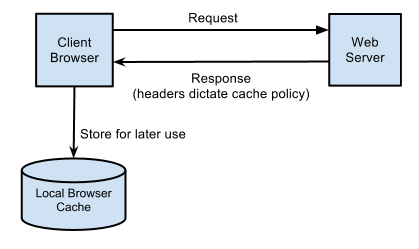
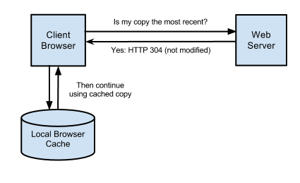
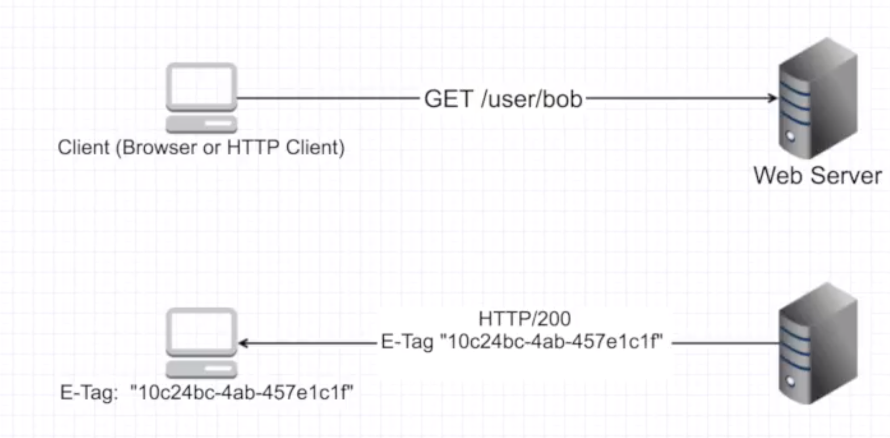
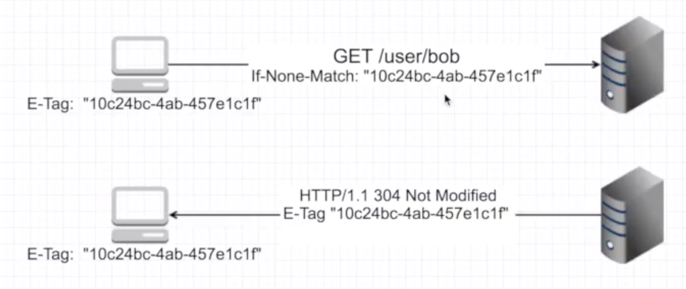

# HTTP Caching

HTTP caching occurs when the browser stores local copies of web resources for faster retrieval the next time the resource is required. As your application serves resources it can attach cache headers to the response specifying the desired cache behavior.

## Use cache to
* improve performance and stability
* reduce server load
* fault tolerance

## HTTP cache headers

* `Cache-Control`
  The `Cache-Control` header is the most important header to set as it effectively ‘switches on’ caching in the browser. With this header in place, and set with a value that enables caching, the browser will cache the file for as long as specified. Without this header the browser will re-request the file on each subsequent request.

  The value of the Cache-Control header is a composite one, indicating whether the resource is public or private while also indicating the maximum amount of time it can be cached before considered stale. The max-age value sets a timespan for how long to cache the resource (in seconds).

  `Cache-Control:public, max-age=31536000`
   
* `Expires`
  When accompanying the `Cache-Control` header, `Expires` simply sets a date from which the cached resource should no longer be considered valid. From this date forward the browser will request a fresh copy of the resource. Until then, the browsers local cached copy will be used. 
  `Cache-Control:public`
   `Expires: Mon, 25 Jun 2012 21:31:12 GMT`  

>**If both Expires and max-age are set max-age will take precedence.**

## Conditional requests
  Conditional requests are those where the browser can ask the server if it has an updated copy of the resource. The browser will send some information about the cached resource it holds and the server will determine whether updated content should be returned or the browser’s copy is the most recent. In the case of the latter an HTTP status of 304 (not modified) is returned.

  

  Though conditional requests do invoke a call across the network, unmodified resources result in an empty response body – saving the cost of transferring the resource back to the end client. The backend service is also often able to very quickly determine a resource’s last modified date without accessing the resource which itself saves non-trivial processing time.

  There are two types of conditional requests
  *  **Time-based**

### Time based
A time-based conditional request ensures that only if the requested resource has changed since the browser’s copy was cached will the contents be transferred. If the cached copy is the most up-to-date then the server returns the 304 response code.

To enable conditional requests the application specifies the last modified time of a resource via the `Last-Modified `response header.

`Cache-Control:public, max-age=31536000`
`Last-Modified: Mon, 03 Jan 2011 17:45:57 GMT`
The next time the browser requests this resource it will only ask for the contents of the resource if they’re unchanged since this date using the If-Modified-Since request header

If-Modified-Since: Mon, 03 Jan 2011 17:45:57 GMT
If the resource hasn’t changed since Mon, 03 Jan 2011 17:45:57 GMT the server will return with an empty body with the 304 response code.
## E-Tags
   * Client makes a request
   * Server responds with response + an E-tag
  
  * when client makes the same service call again, it sends over the e-tag as well
  * Server uses the e-tag and checks if response changed.
  * If it didn't it sends back a `304` not modified response.
  * this saves a lot of bandwidth!
  

  **Cons on E-tags**
  * when the app servers are behind load-balancers, the e-tags might be registered as the same amongst different servers.
  * 