# Critical Rendering Path : 
https://classroom.udacity.com/courses/ud884

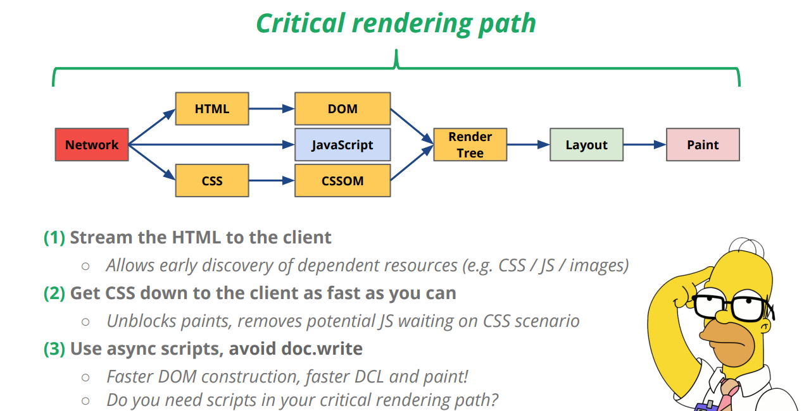

The critical Rendering path is the sequence of path that the browser goes through to conver the HTML,CSS,JS to actual pixel on the screen.

Here's a quick list of the browser's steps:

* Process HTML markup and build the DOM tree.
* Process CSS markup and build the CSSOM tree.
* Combine the DOM and CSSOM into a render tree.
* Run layout on the render tree to compute geometry of each node.
* Paint the individual nodes to the screen.

Optimizing the critical rendering path is the process of minimizing the total amount of time spent performing steps 1 through 5 in the above sequence. Doing so renders content to the screen as quickly as possible and also reduces the amount of time between screen updates after the initial render; that is, achieve higher refresh rates for interactive content.

# DOM 

The Browser has a series of steps which enables it to translate the HTML code ite received from the server into the actual page you see on your system. 

How did it go from markup to the visual thing you call a web page?

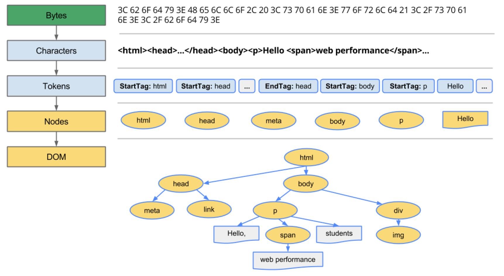

> The final output of this entire process is the Document Object Model (DOM) of our simple page, which the browser uses for all further processing of the page. The DOM is the full parse representation of the HTML Markup

The browser constructs the DOM incrementally, so we can take advantage of that.

**Incremental HTML delivery**

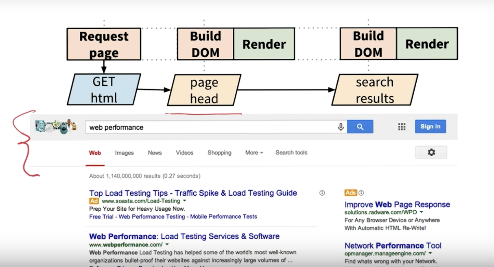

We basically don't have to wait for all of the html to arrive before processing it! we can first fetch the html for the header, construct the DOM , then  request once again for results.

# CSSOM 

CSS Object model contains all the styles of the page.

* Very similar to HTML to DOM conversation.
* The main difference is that CSS rules cascade down. Meaning the parent rules will cascade and also apply to it's children nodes.

> **We can't do incremental CSS delivery technique! We can't use a partial CSS tree. This is also why it is a good idea to split your css into multiple sheets, so that we can get them one file at a time, since we can't build them incrementally. Especially on mobile**

The reason we can't do a partial CSS tree because then it can lead us to display the styles incorrectly.

The browser blocks page rendering , it receives and process all of the CSS. 

> **CSS is render blocking**
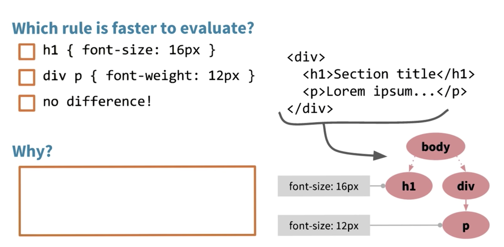 

**Answer** : The first rule is faster! Since it is less specific. The more specific the rule the slower is the processing.

## Render Tree

* It only captures the visible content
* To construct a render tree, we check at the Root of the DOM and check if there are any styles that match it in the CSSOM.
* If we find any matching css, then we copy both the DOM and the CSS styles to the Render tree.
* In case we see any `display:none` we can skip copying it and it's children, since we only display visible content! 

> visibility: hidden is different from display: none. The former makes the element invisible, but the element still occupies space in the layout (that is, it's rendered as an empty box), whereas the latter (display: none) removes the element entirely from the render tree such that the element is invisible and is not part of the layout.

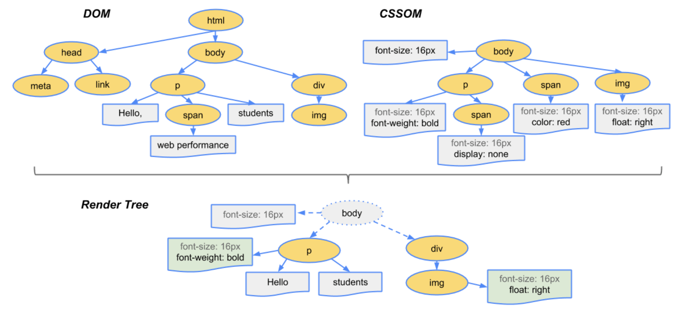

## Javascript

* Javacript can query the DOM and CSSOM as well
* Script execution can change the input stream, hence **we must wait**
* DOM construction can't proceed untill JavaScript is fetched
* DOM construction can't proceed untill Javascript is executed!

> **If you put JS on the top of your html file, it's going to block you on the network**

* Sync Scripts block the parser
* Async script will not block the DOM / Rendering.

## Layout 

* This step tells us where we need to position the elements.

* To figure out the exact size and position of each object on the page, the browser begins at the root of the render tree and traverses it. 

* The output of the layout process is a "box model," which precisely captures the exact position and size of each element within the viewport: all of the relative measurements are converted to absolute pixels on the screen.

* Finally, now that we know which nodes are visible, and their computed styles and geometry, we can pass this information to the final stage, which converts each node in the render tree to actual pixels on the screen. This step is often referred to as "painting" or "rasterizing."

## Paint

## The preload scanner
## Tools 

Chrome DevTools > Audits > Web Page Performance 

https://developers.google.com/speed/pagespeed/insights/?url=www.facebook.com

## ALL STEPS !

https://www.igvita.com/slides/2013/fluent-perfcourse.pdf

   *   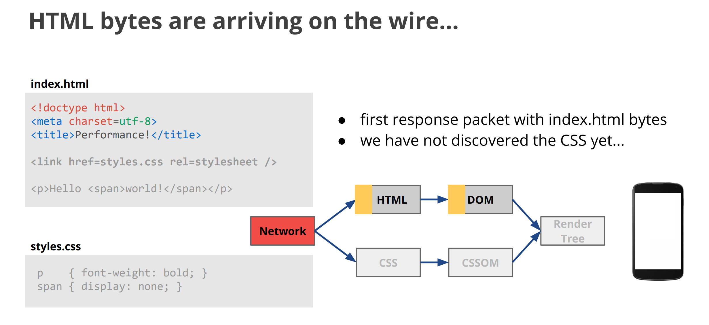
   *   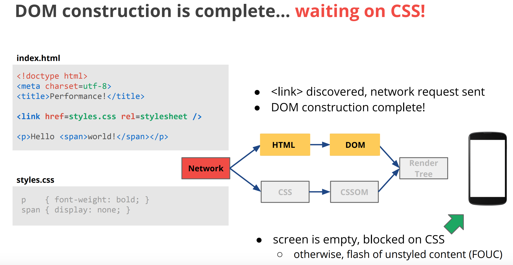
   *   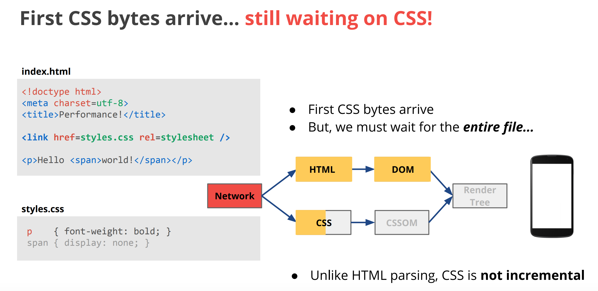
   *   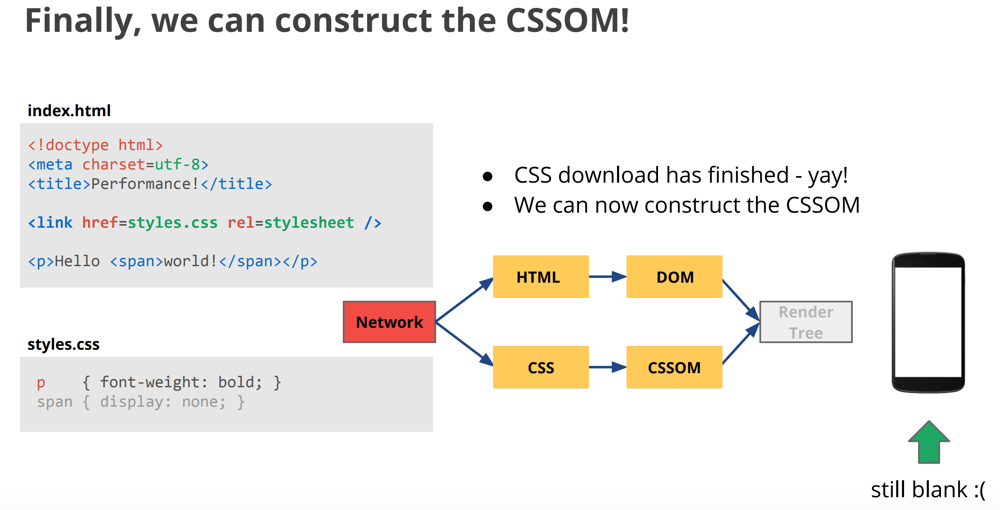
   *   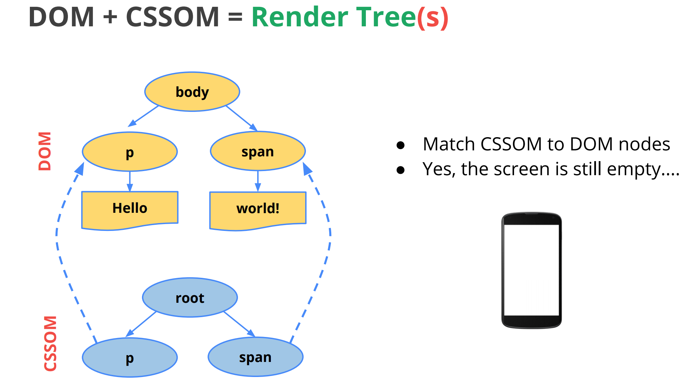
   *   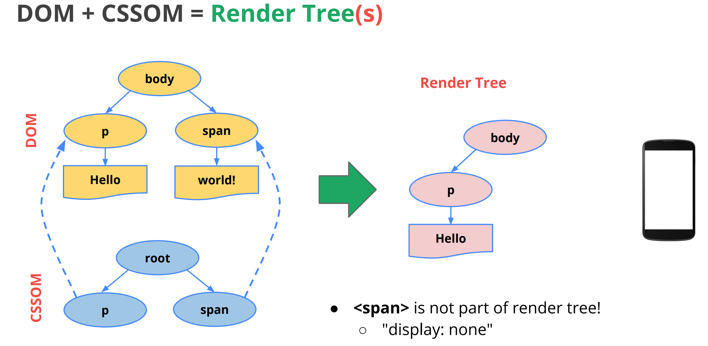
   *   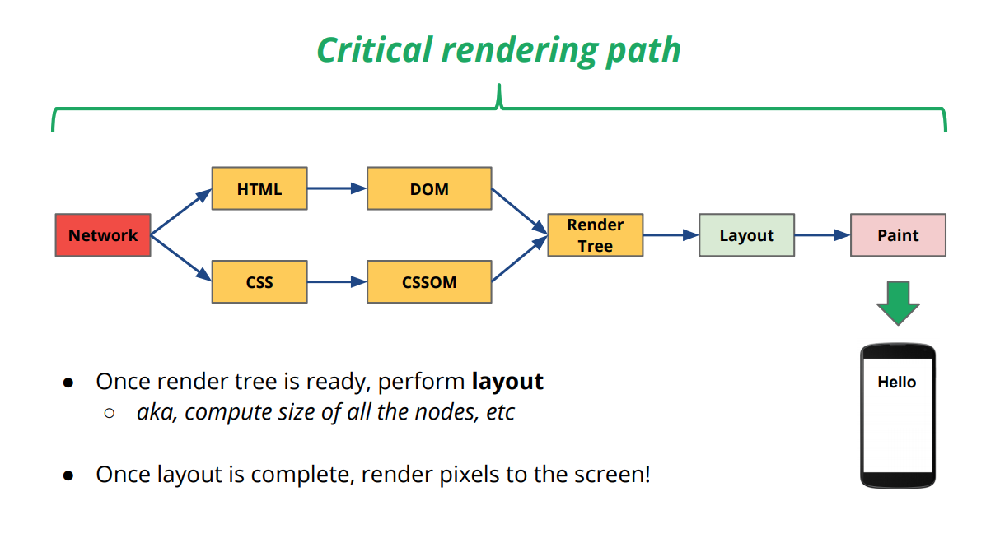

