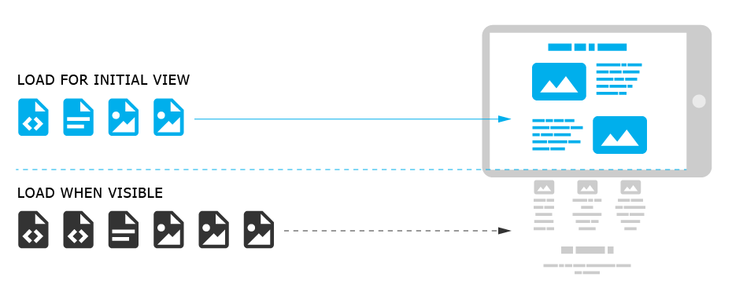
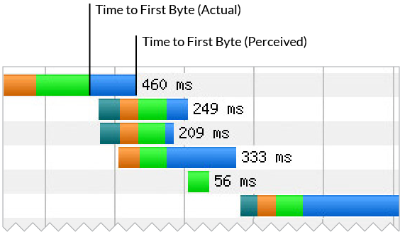
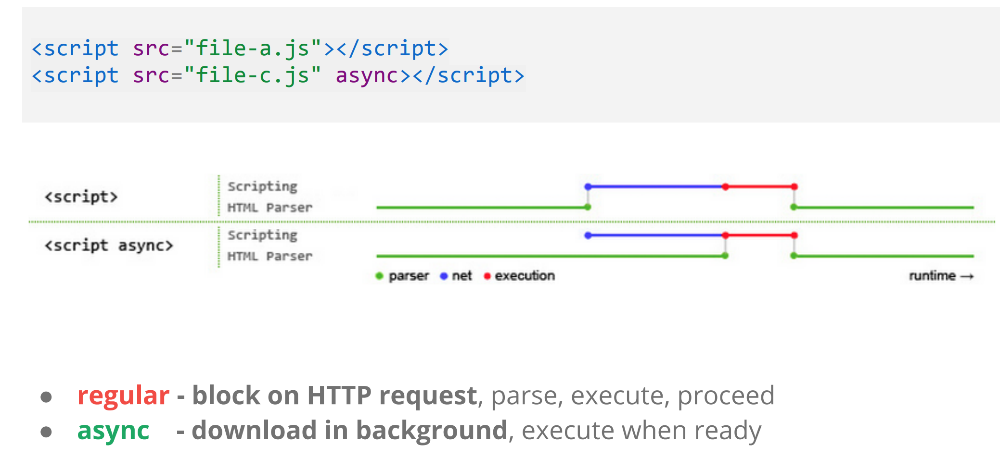
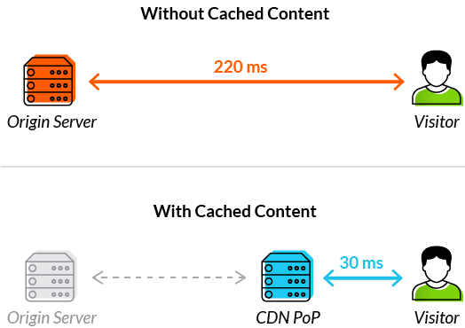

# Front-End-Performance-Optimizations
<hr>

A list of techniques / best practices / insights for the different parts of the front end.

<hr>
## Load Time

#### Perceived Load time
>Perceived load time is considered because of its impact on the overall user experience (UX)

1. **Use activity and progress indicators** : If you have certain page elements that load slowly on your site or slow operations that impact the user experience, you should consider using an activity indicator like a spinner. `Activity indicators` reassure visitors that the page is actually working and loading.

    Even better, use a `progress bar` that displays what percentage of the site has already loading. This not only helps reassures restless users, but gives a sense of how much longer they will need to wait.

    Use the ios / android default spinners if possible, since they would attribute slowness with the phone and not the app.

    
  2. **Load above-the-fold**
      - Structure your HTML to load the critical, **above-the-fold content first**
      Load the main content of your page first. Structure your page so the initial response from your server sends the data necessary to render the critical part of the page immediately and defer the rest. This may mean that you must split your CSS into two parts: an inline part that is responsible for styling the ATF portion of the content, and the part that can be deferred.

      - Reduce the amount of data used by your resources
  3. **Lazy loading and Progressive loading of images** 
     Lazy loading is a way for your website to not load content until users scroll down far enough to see it. This practice can not only save a lot of bandwidth, as it can also speed up your website by margins.

     Lazy loading typically use JavaScript to see the space where the image will load within the viewport. If the image enters the rendered area, JavaScript will fire up to load the image.

      

      **Progressive loading** : Refer to Images section!
      <br>
  4. **Preloading content**
     Preloading content allows you to prioritize the loading of certain content on the page. Using the preload value of the <link> element’s rel attribute, you can write declarative fetch requests that specify resources that your pages need very soon after loading, and which you want to start preloading early before the browser’s main rendering machinery begins.<br>
      This ensures that these resources are made available earlier and are less likely to block the page’s first render, which is turn provides performance improvements.<br>
      Preload is a relatively new-ish web standard aimed at providing more granular loading control to web developers. It allows developers to define custom loading logic without suffering the performance penalty that script-based resources loaders incur.

#### Actual Load time
>Actual load time is often used as a performance benchmark metric.

Page load time is a key performance metric for any website to help ensure a positive user experience and customer retention. Additionally, it’s been shown to influence a site’s search engine rankings.

**Round-trip time (RTT)** — Measured in milliseconds, RTT is the duration from when a browser first sends out a request to when a response is returned. It’s a critical aspect of page load time, since the browser cannot begin to parse content until it receives a server response.

Factors influencing RTT include the physical distance between the visitor and server, server traffic volume and the number of intermediate nodes tthe request needs to pass through.

**Time to first byte (TTFB)** — Actual TTFB is the time taken for a browser to receive the first response byte from a server. However, a more precise definition is perceived TTFB, which is the duration during which sufficient HTTP content loads before the browser can begin parsing it.

Three key factors determine TTFB: `network latency`, `server load time` and `server processing time` (dynamic HTML content taking longer to process than static pages).

Web page load times—and especially TTFB—have been shown to be more prominent SEO ranking factors. Even a small reduction in TTFB can increase the chance a site will be found organically by potential visitors.

<hr>
## Application server

* **Text Compression** : 
    - GZIP performs best on text-based assets: CSS, JavaScript, HTML.
    - All modern browsers support GZIP compression and will automatically request it.
    - Your server must be configured to enable GZIP compression.
    - All modern browsers support and automatically negotiate GZIP compression for all HTTP requests. You must ensure that the server is properly configured to serve the compressed resource when the client requests it.
* **Dead code removal** : remove all the unused code from the file and only ship what is needed, then this can often result in speed boosts. Use the 'Coverage' tab / dev tools to see which files are not really used.
* **Minification** : HTML , CSS , JS can be minified by removing `whitespace` , `code comments`, `inefficient-css-rules`

<hr>
## HTML 
  1. **HTML is parsed incrementally** 
      - Which means the  Application server can stream the HTML response to the client in bits! Flush early, flush often.
      - We essentially take advantage of the Critical rendering path to parse as and when we can, instead of waiting for the whole HTML file.
<hr>

## CSS
  1. **Rendering is blocked on CSS**
     - Get the CSS down to the client as fast as you can
     - Sometimes we deliver the css in **split** files,
   for example we deliver 50/500 styles in the first file and then load the rest later.
     - Media types and **media queries** allow us to mark some CSS resources as non-render blocking. We can put all out @Media print styles to a specific file and include it like this `<link rel="stylesheet" href="style-print.css" media="print">` this was this CSS will be non-blocking!
     
   1. **Internal vs External CSS**
     - For super fast CSS download, include some main styling elements inside the html file itself.
     - This is a trade off, between seperation of concern and speed. So tread cautiously. Might be necessary for mobile.
<hr>

## JS
  1. **Javascript blocks DOM**
     - Put your Scripts at the bottom of the page, since when JS is encountered on a page, it blocks the parsing and rendering untill it is fetched and executed
     - Avoid `doc.write`  
  2. **Async all the things**
     
  3. **Profilers**
<hr>

## Images
1.  **Image re-sizing**
    - Ideally, your page should never serve images that are larger than the version that's rendered on the user's screen. Anything larger than that just results in wasted bytes and slows down page load time.
    - Optimize each image.
    - Options include
      1. The main strategy for serving appropriately-sized images is called "**responsive images**". With responsive images, you generate multiple versions of each image, and then specify which version to use in your HTML or CSS using media queries, viewport dimensions, and so on.
          ```
            
          ```
          The `srcset` attribute takes a comma-separated list of image URLs, each with an `x ` descriptor stating the `device-pixel-ratio` that that file is intended for.

          The `src` is there for browsers that don’t understand `srcset`. The `alt`, of course, is included for browsers that don’t render images at all. One element and three attributes gets us an image that looks crisp on high-resolution devices and efficiently degrades all the way down to text. Not too shabby!

      2. Create Multiple sizes and use srcset
      3. Use an image CDN which let you generate multiple versions, either when you upload an image, or request it from your page.
  1. **Progressive loading** 
      
      Progressive can be a great way to accommodate lazy loading. It works by rendering an image in low-resolution, and progressively enhances itself over time. There are two ways progressive images can be implemented. The first is to use encoding, and the second is using placeholders.<br>
      Major browsers can use load images progressively. They can render low-resolution approximations of progressively encoded images to screen, long before the full file has been downloaded.<br>
      Common website image formats such as .jpeg, .png and .gif can all be progressive images. But they use different form of encoding.<br>
      Placeholders don't actually make images to load faster. But they can help user experience as they are simply telling users that images are on their way. Placeholders are common on websites that use a lot of images.

      **Examples of placeholder**s include:
      * Rendering an empty space that match the dimension of the image to be loaded.
      * Having an icon to represent the content that is yet to be loaded.
      * Solid color that is similar to empty space, but filled with color.
      * **Low-resolution image** which is small in size and blurry. The image will transition to the full image when the original quality image is ready. 
  
  This technique can be combined with responsive and lazy loading to make sure than users' browser only download images when they need them, without sacrificing experience by much.
<hr> 

## HTTP / TCP / DNS / Networking

  1. **Redirects are expensive**
      - On mobile it is extremely expensive
      - If one http connection takes me a second , this is gonna be almost twice as much now if a re-direct happens!
      - It means new DNS lookup + new TCP , starting all over again!
  2. **Reduce HTTP requests**
      When loading a web page, a browser has to open a separate TCP connection for each HTTP request made, which is equal to the amount of page elements it’s required to download.<br>
      The problem is that there is a limit to the number of concurrent connections a browser can open to a single host. This limit exists to protect a server from being overloaded with a high number of HTTP requests. However, it also serves as a potential bottleneck, often forcing the browser to start queuing connection requests.<br>
      As the maximum connection threshold is quickly reached, various FEO techniques are employed to minimize the number of individual page elements.
      * **Resource Consolidation**   : the practice of bundling together multiple smaller files
      
  3. **CDNs** can further reduce server response time by pre-pooling connections and making certain that they remain open throughout a session.
<hr>
## Mobile 

Lets say we want to break the 1000ms time barrier in Mobile.

Some facts we need to keep in mind 

1. Majority of time is in network overhead ( lets say 800 ms for 3g phones)
2. Fast server processing time is a must ( < 100ms)
3. Must allocate time for browser parsing and rendering (< 100 ms overhead)

How do we do it ?

1. Inline just the required resources
   1. No room for extra requests
   2. Idetify and inline critical css
   3. Eliminate JS from CRP
2. Defer the rest untill after 'above the fold' is visible

<hr>
## Frames

* Javascript Induced Jank needs to be reduced 
* Aggregate your scroll events and defer them
* Process aggregated events on next requestAnimationFrame callback
    - which says call me anytime a new frame starts.

<hr>
## Caching!
1. **HTTP cache headers**
2. **CDN Pop**
    
    
The downside is that manual cache header management can be a tedious and inefficient task. Moreover, caching mechanisms often run into issues when handling dynamically generated content created on-the-fly as a page begins to load (e.g., AJAX objects and even dynamically generated HTML files).


<hr>
## CDN

* Content delivery networks (CDNs) accelerate website performance by minimizing TTFB through the rapid delivery of HTML files—even when dynamically generated.

* CDNs store cached versions of your site content in geographically distributed **points of presence (PoPs)**. Each PoP has a number of caching servers responsible for expedient content delivery to visitors within its proximity.
