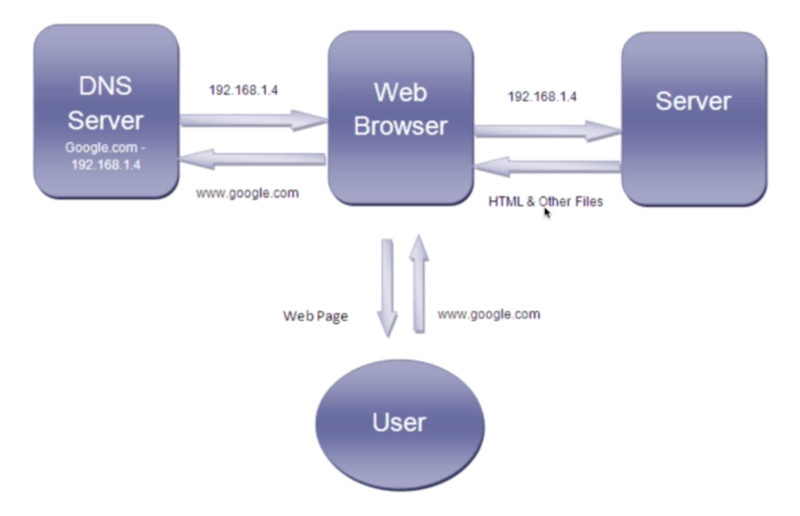
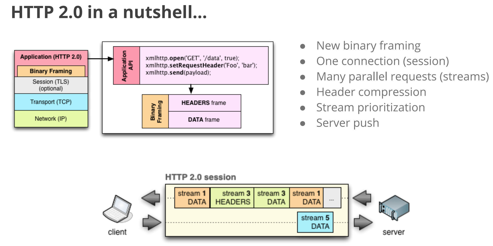

# Basics of the Web
---
## The internet
* A global network of computers
* Each computer has an IP address.
  Devices have private addresses, routers have public addresses.
* Computers talk to each other using the TCP/IP protocol.
* HTTP handles web traffic ( requests / responses.)
* Webites / Webpages are files stored on computers that run on a piece of software called a web-server( Apache, Nginx)
* DNS is used to map IP addresses to domain names.
* We purchase a domain name from registrars and link them to our hosting account / web server.

## DNS 

 The Domain Name System is an essential component of the functionality of most Internet services because it is the Internet's primary directory service.
 

## HTTP 
Stands for Hyper text transfer protocol

* Application layer protocol on TCP/IP.
* Transmits hypermedia documents
* Designed for communication between web browsers and web servers.
* It follows a classical **Client-Server model**, with a client opening a connection to make a request, then waiting until it receives a response.
* HTTP is a stateless protocol, meaning that the server does not keep any data (state) between two requests.
* based on a TCP/IP layer, it can be used on any reliable transport layer; that is, a protocol that doesn't lose messages silently, such as UDP.

>**A complete document is reconstructed from the different sub-documents fetched, for instance text, layout description, images, videos, scripts, and more.**

Clients and servers communicate by exchanging individual messages (as opposed to a stream of data). The messages sent by the client, usually a Web browser, are called requests and the messages sent by the server as an answer are called responses.

**Proxies**

Between the Web browser and the server, numerous computers and machines relay the HTTP messages. Due to the layered structure of the Web stack, most of these operate at either the transport, network or physical levels, becoming transparent at the HTTP layer and potentially making a significant impact on performance. Those operating at the application layers are generally called proxies. These can be transparent, or not (changing requests going through them), and may perform numerous functions:

* caching (the cache can be public or private, like the browser cache)
* filtering (like an antivirus scan, parental controls, …)
* load balancing (to allow multiple servers to serve the different requests)
* authentication (to control access to different resources)
* logging (allowing the storage of historical information)

>**HTTP is stateless, but not sessionless**
* while the core of HTTP itself is stateless, HTTP cookies allow the use of stateful sessions. Using header extensibility, HTTP Cookies are added to the workflow, allowing session creation on each HTTP request to share the same context, or the same state.

### HTTP and connections
* Connections are controlled at the transport layer
* TCP is reliable and UDP isn't, HTTP relies on TCP.
* Before a client and server can exchange HTTP a request/response pair, they must establish a TCP connection, a process which requires several round-trips.
* The default behavior of **HTTP/1.0 is to open a separate TCP connection for each HTTP request/response pair**. This is less efficient than sharing a single TCP connection when multiple requests are sent in close succession.

### HTTP status Codes

https://httpstatuses.com/ 

1xx : Information for progress
2xx : Successful
3xx : Redirection
4xx : Client side error
5xx : Server Side error

200 : OK
301 : Moved permantently
404 : Not found
403 : Forbidden
401 : Unauthorized
500 : Internal server error
503 : Service unavailable
### HTTP 2
HTTP/2 is a replacement for how HTTP is expressed “**on the wire**.” It is not a ground-up rewrite of the protocol; HTTP methods, status codes and semantics are the same, and it should be possible to use the same APIs as HTTP/1.x (possibly with some small additions) to represent the protocol.

The focus of the protocol is on performance; specifically, end-user perceived latency, network and server resource usage. One major goal is to allow the use of a single connection from browsers to a Web site.

* HTTP 1.1 requires several separate requests that go back and forth to get one single page. Http 2 really reduces the number of round trips,by using a **Single TCP connection** to fetch multiple things
* **Server Push** : In certain cases server can send me down documents that I never asked for! For example if I request index.html, then it sends me the index.html , also pushes the other resources like .css and .js on the same wire!

## HTTPS

## WebSockets

WebSocket is a protocol providing full-duplex communication channels over a single TCP connection. The WebSocket protocol was standardized by the IETF as RFC 6455 in 2011, and the WebSocket API in Web IDL is being standardized by the W3C.