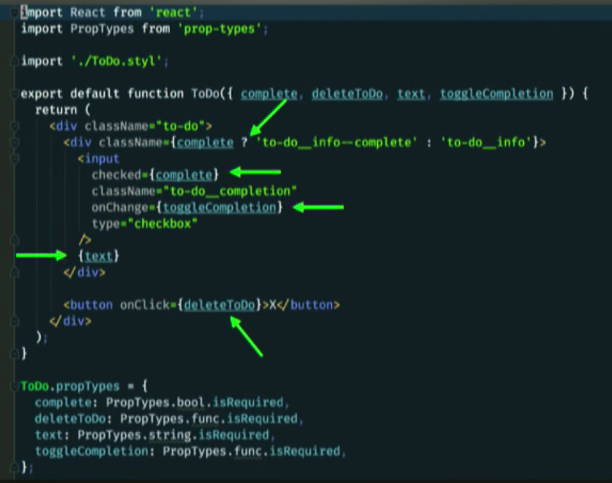
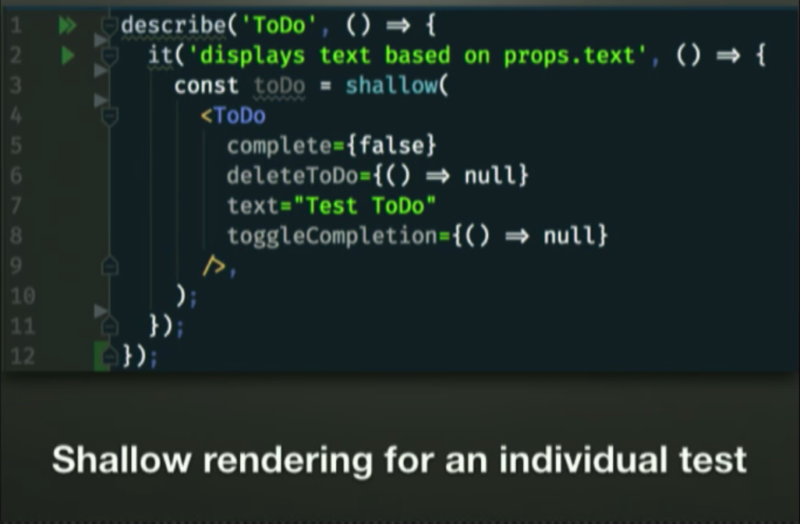

# Testing React
---
## Why unit test ?
* Greater confidence when changing code
* Catch regressions - when you break something, you know where exactly it broke if you write good tests.
* Easily testable code is usually better code.
* Every change has to be intentional - You can't accidentally just change something and say it works.
* Bragging rights - "Yea we got 100% code coverage" :B

Unit testing is about developer happiness and being confident about your own code and not about just getting it done and it is needed inspite of end to end testing and QA.

>Unit testing Isn't everything though!

## Enzyme . Why Enzyme ?

* Open sourced and written by Airbnb
* It is a higher level abstraction over the React's test utils.
* It is officially recommended by the React team.
* Really good docs.

## What should we test ?


**Anything that is not static**

Mostly the stuff that we get through props.

## Setting up the test file

```javascript
import React from 'react';
import toJson from 'enzyme-to-json';
import { shallow } from 'enzyme';
```
* **React**  - Anywhere you are using JSX you need react
* **toJson** - A tool to help in setting up snapshots
* **shallow** - One of Enzyme's test renderers, to render out component.

## Shallow Rendering



We create a variable `toDo` and assign the return of the shallow-render method with the props as shown.

We render the fake component as a JS object to give an idea of what the output is likle.

## Expect statements

After setting up the test file and shallow rendering the component we can run a test and see if it behaves as expected.

```javascript
expect(toDo.find('.to-do_info).text()).toBe('Test Todo');
```

>.find follows similar synatax to document.querySelector. You can search by any valid CSS selector or component name.

## User Interactions 

An user interaction at its core is an event handled by a function.

We setup a new shallow render variable! Infact we want to setup a new one for every `it` block because you don't want some artifact from the previous test come change this for you, since this is all state driven and the possibility for state to get changed is high.

#### Setup 
```javascript
it('ToDo calls props.toggleCompletion on checkBox change', ()=> {
  const toggleCompletionSpy = jest.fn();
  const toDo = shallow(
    <ToDo
      complete
      deleteTodo = { () => null }
      text = "Test ToDo"
      toggleCompletion = {toggleCompletionSpy}
    />,
  );
})
```
Spy here is a mocked function for the event handler , that allows us to track its calls and arguments. 

#### Simulate change

```javascript
toDo.find('.to-do__completion').simulate('change');
```

#### Check spy and verify if user interacted?

expect(toggleCompletionSpy).toHaveBeenCalled();

## Testing Stateful components

>**It is recommended you don't explicitly set state like comp.setState({toDo: `foo`})**, because a user would not do so.


#### Testing handle change ()
* You would render and pass props the same way, settting it up using a shallow render.

* We could directly access the handleChange() using .instance(),but we shouldn't. Because weare testing the method, but not the implementation. We want to make it as realistic as possible.
  ~~newTodo.instance().handleCHange( {target : {value 'some to do text'}});~~

* What we do want to do is to find the input -> simulate a change and pass an object. We make our own fake event here with a target and then pass it a value and see if it is what was expect in the `state`


> Here we don't use the actual DOM event firing, we are all in JS so we create everything using a mock event.

#### Testing SubmitTodo ()
 
 >It is recommended that you don't use setState() , and try to use simulate the state.

 We are going to 3 different tests where we shallow render the component in each test and have checks as following.

 
 Test 1 )
  ```javascript 
  it( '   ' , () => {
    const submit = jest.fn();
    const newToDo = shallow( .....) ;

    newToDo.find(...)
           .simulate(....)
           .simualte(....);
    // Check expected submit was called with props
    expect(submit).toHaveBeenCalledWith('....');
  });
  ```
  Test 2 ) State is cleared
  ```javascript
  t( '   ' , () => {
    const newToDo = shallow( .....) ;

    newToDo.find(...)
           .simulate(....)
           .simualte(....);
    // Check state is as expected
    expect(newTodo.state().toDo).toBe('');
  });
  ```
  Test 3 ) PreventDefault is called
  ```javascript
  t( '   ' , () => {
    const preventDefault = jest.fn();
    const newToDo = shallow( .....) ;

    newToDo.find(...)
           .simulate(....)
           .simulate(....);
    expect(preventDefault).toHaveBeenCalled();
  });
  ```
## UI Testing
We are going to be using snapshots to test UI.
They are not mutually exclusive but make a powerful pair. They can be used to catch UI regressions.


A snapshot is a string basically with some react looking stuff in it.

The toJson library takes the JS rendered component into something like this.


* You don't have to exhaustive tests checking element lengths and classes, like finding classList lengths.
* No need to re-write tests for every minor UI change, just update the snapshot.
* Git diffs are more clear and concise for UI changes.

## Necessary Dependencies

* Jest
* Enzyme
* enzyme-to-json
* react-addon-test-utils ( required by Enzyme) 
* react-test-renderer - required by Enzyme
* react-test-renderer
* JSDOM ( optional)


