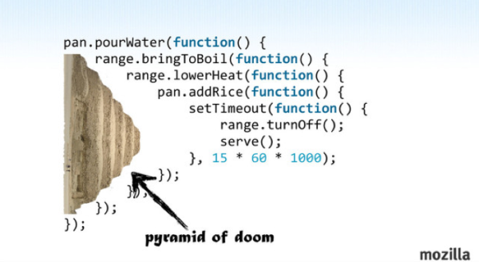

# Async
----
Asynchronous programming is basically having sections of your code that complete in parallel in their own sweet time , or return some response after an arbitrary unpredicatable time . You have to structure the rest of your code to handle this! 

> Our brains work in a synchronous fashion, we go from line 1 - line 2 to line3! But the reality of JS code is async in nature.

Multi tasking is just fast context switching! We can't think asynchronously.

The goal of the following solutions is essentially around the premise of "How do I take something that is fundamentally async, and structure about it in a synchronous fashion so I wrap my head around it"
# Callbacks

* Callbacks stand for continuation ! It is one way to handle async tasks!
* The problem with callbacks is that it works 'Okay' with one split and is really bad with more than one split!
* When you nest callbacks it results in heavily indented code , that is hard to read and hard to code / debug.
* This super unsustainable block of code is called as  "callback hell" , also called as "Pyramid of Doom"
  **Callback Hell example**
  ```javascript
  a(function( resultsFromA) {
    b(resultsFromA, function(resultsFromB){
      c(resultsFromB,function(resultsFromC){
        d(resultsFromC, function(resultsFromD){
          e(resultsFromD, function(resultsFromE){
            f(resultsFromE, function(resultsFromF){
              console.log("THIS IS CALLBACK HELL!");
            })
          })
        })
      })
    })
  });
  ```
  
  <br>
  >**Callback hell has nothing to do with indentation, although it shows up as indentation, the real problem is deeper**

  <br>**Inversion of Control**
  Callbacks suffer from inversion of control in that they **implicitly give control over to another party** (often a third-party utility not in your control!) to invoke the continuation of your program. This control transfer leads us to a troubling list of trust issues, such as whether the callback is called more times than we expect.
  <br>
  Inventing ad hoc logic to solve these trust issues is possible, but it's more difficult than it should be, and it produces clunkier and harder to maintain code, as well as code that is likely insufficiently protected from these hazards until you get visibly bitten by the bugs.
  <br>
  We need a generalized solution to all of the trust issues, one that can be reused for as many callbacks as we create without all the extra boilerplate overhead.

  >**Two issues with callbacks 1) Asynchronous representation of code 2) Inversion of control**

# Generators / Co routines
# Promises
  **Metaphor 1** : You walk upto to Mcdonalds and order something, you are then given a receipt. And then you wait among other people, to hear your receipt number called out and then you exchange this receipt for your Food later on.

  THAT IS A PROMISE! 

  You have an asynchronous transaction that needs to happen, you get a promise from the person who is performing the transaction, then later you exchange the promise for the actual results at a later time.

  **Metaphor 2** : What if we could call a function, and we don't know when that will finish. Then we subscribe for an  completion event and then we proceed once we get that event!

  **How does it solve inverstion of Control issue ?**  
  Instead of passing my continuation in, I receive a promise in and puts me back in control.

  ### Creating Promises
  To create a promise you use a `promise` constructor and a Callback function.

  let p = new Promise(callback function ) ;

  And the callback function sets up what the promise is to do and also how to handle the resolve and reject.

  Resolve : Function that will be invoked when promise is resolved
  Reject : function that will be invoked when promise is rejected.

  ```javascript
  let p = new Promise( function(resolve, reject) {
    setTimeout(function() {
        //do something
        let result = apiCall(data);
        if(result === true) {
          resolve('Success');
        }
        else {
          reject('Failure');
        }
    },4000);
  });

  ```
  https://www.youtube.com/watch?v=iD42bSyhmdw
  ### Basic usage of  promises
  ### Advanced promise usage
  ### Fetch api

# Async Await