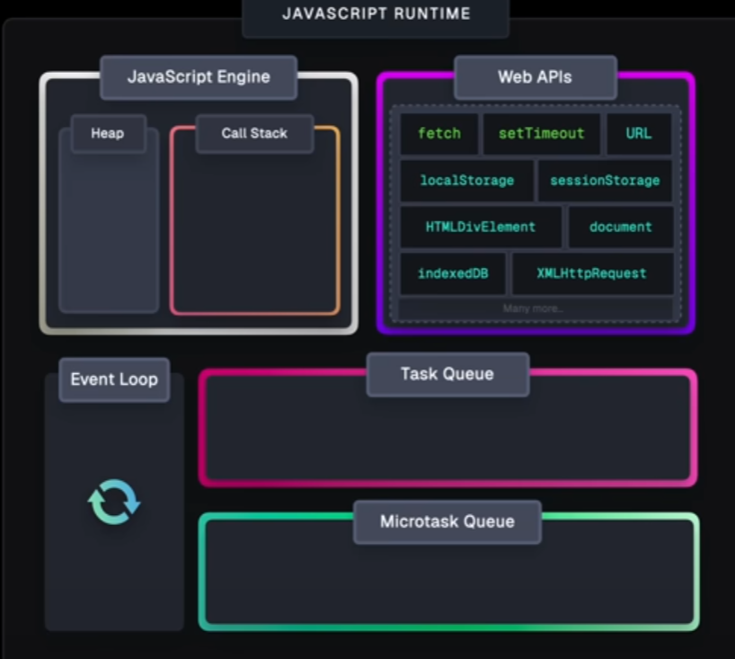

# The event loop

The event loop is a tiny part of the Javascript runtime that co-ordinates tasks in such a way that it makes JS ( a single threaded language) appear to be near multi threaded.
It alters the behavior of the engine in such a way that the engine appears 

THe Runtime consists of
    * Call Stack
    * Web apis
    * Task queue
    * MicroTask Queue
    * The event loop

Heap is not discussed here since Call stack is the part we care about , but heap is basically a memory allocation on the RAM that is used by the engine to perform its' space operations.

